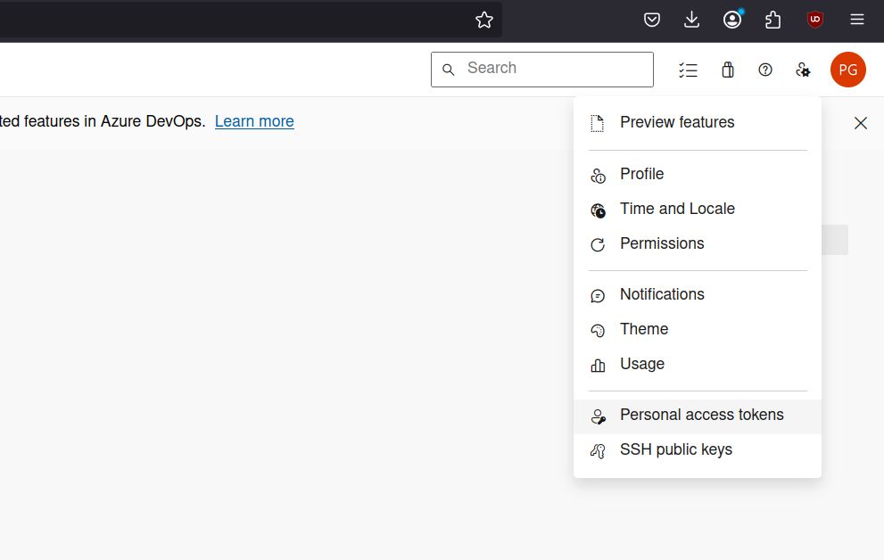
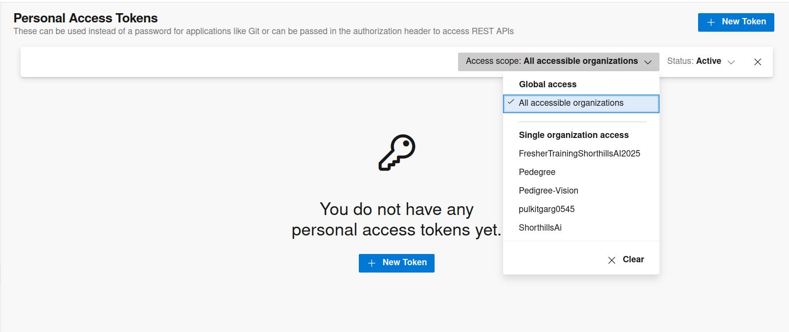
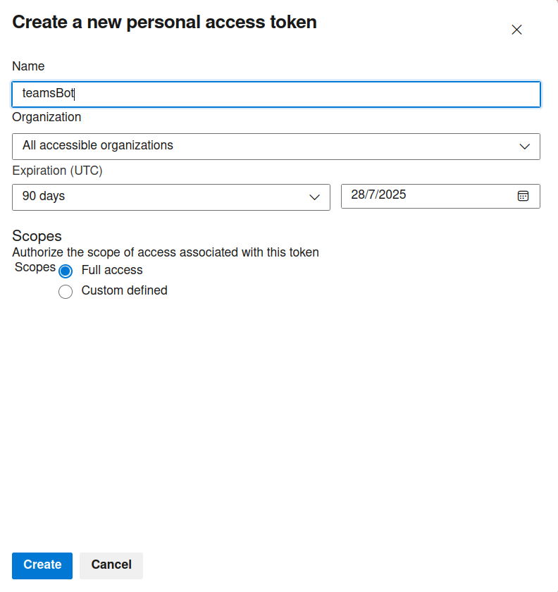

# TeamsBot User Manual

## Overview

TeamsBot is a VS Code extension that integrates with Azure DevOps Boards and Google Gemini, allowing you to manage work items, sprints, and tickets directly from a chat sidebar.

---

## 1. Update VS Code 

### Install VS Code on Debian/Ubuntu

```bash
wget 'https://code.visualstudio.com/sha/download?build=stable&os=linux-deb-x64' -O /tmp/code_latest_amd64.deb
```
``` bash
sudo dpkg -i /tmp/code_latest_amd64.deb
```
## 2. Creating a Global Access PAT Token on Azure Boards

1. **Sign in to Azure DevOps**  
   Go to [https://dev.azure.com/](https://dev.azure.com/) and sign in with your organization account.

2. **Open User Settings**  
   Click the button left to your profile photo on the top right corner.
   

3. **Create a New Personal Access Token (PAT)**
   - Click `+ New Token`.
   - **Name:** Choose a descriptive name (e.g., `VSCode TeamsBot`).
   - **Organization:** All accessible organizations.
   - **Scopes:**  
     - Set to `Custom defined`.
     - Give it full access
   - **Expiration:** Choose a suitable expiration (e.g., 90 days, 180 days) recommended will be 1 year.
   - Click `Create`.

   

   

   - Note - If you choose a specific organization the PAT token wont work

4. **Copy the PAT Token**  
   Copy and save the token securely. You will need it for the extension.

---

## 3. Installing and Setting Up the Extension

1. **Install the Extension**
   - Open VS Code.
   - Go to the Extensions sidebar (`Ctrl+Shift+X`).
   - Search for `TeamsBot` and install it.

2. **Open the TeamsBot Sidebar**
   - Click the TeamsBot icon in the Activity Bar (left sidebar).
   - The chat interface will appear.

---

## 4. Authentication and Configuration

1. **Sign in with Microsoft**
   - The extension will prompt you to sign in with your Microsoft account.
   - Only users with `@shorthills.ai` emails are authorized.

2. **Enter Your PAT Token**
   - On first use, or after resetting, you will be prompted to enter your Azure DevOps PAT token.
   - Paste the token you created earlier.

3. **Select Organization and Project**
   - Use the dropdowns at the top to select your Azure DevOps organization and project.

---

## 5. Commands and Functionality

You can interact with TeamsBot using natural language or the following commands:

### Ticket Management

- `@create_ticket <title> description '<description>'`  
  Create a new ticket with a title and description.  
  _Example:_  
  `@create_ticket Fix login bug description 'Users cannot log in with Google accounts.'`

- `@create_ticket_from_last_commit`  
  Create a ticket based on the last git commit in the workspace. The bot will analyze the commit message and changes to generate a meaningful ticket.

- `@create_ticket_from_commit <commit_id>`  
  Create a ticket based on a specific git commit ID.  
  _Example:_  
  `@create_ticket_from_commit abc123`

- `@view_tickets`  
  View all your open tickets.

- `@view_tickets <id>`  
  View details of a specific ticket by ID.  
  _Example:_  
  `@view_tickets 1234`

- `#<id> @comment <comment text>`  
  Add a comment to a ticket.  
  _Example:_  
  `#1234 @comment This needs urgent attention.`

- `#<id> @update title '<title>' description '<description>'`  
  Update a ticket's title and description.  
  _Example:_  
  `#1234 @update title 'Improve UI' description 'Redesign the dashboard for better usability.'`

- `#<id> @update_with_commit <commit_id>`  
  Update a ticket with information from a specific git commit. The bot will analyze the commit message and changes to update the ticket's title and description.  
  _Example:_  
  `#1234 @update_with_commit abc123`

### Board and Sprint Management

- `@board_summary`  
  Show a summary of all tickets on the board, including counts by state and per user.

- `@sprint_summary`  
  Show a detailed summary of tickets by sprint, including assignments and states.

- `@epic_summary <iteration_path>`  
  Show a summary of epics and their completed tasks for a specific iteration.  
  _Example:_  
  `@epic_summary Sprint 1`

### Overdue Tickets

- `@overdue_tickets`  
  Show all tickets that are past their due date but still active or new.

- `@overdue_tickets my`  
  Show your own overdue tickets.

- `@overdue_tickets of <name>`  
  Show overdue tickets for a specific person.  
  _Example:_  
  `@overdue_tickets of John`

- `@overdue_tickets as of <date>`  
  Show overdue tickets as of a specific date.  
  _Example:_  
  `@overdue_tickets as of 1st May` or `@overdue_tickets as of 20 Jan 2024`

- `@overdue_tickets of <name> as of <date>`  
  Show overdue tickets for a specific person as of a specific date.  
  _Example:_  
  `@overdue_tickets of John as of 3rd May`

### Querying Tickets

- `@query_tickets <query>`  
  Query tickets by name, sprint, or other criteria.  
  _Examples:_  
  - `@query_tickets show me all tickets of John`
  - `@query_tickets show me tickets in sprint 2`

### Help

- `@help`  
  Show all available commands and usage instructions.

---

## 6. Usage Tips

- **Quick Actions:**  
  Use the quick action buttons at the top of the chat for common commands.

- **Input Box:**  
  The input box grows as you type. Press `Enter` to send.

- **Organization/Project Selection:**  
  If you change your PAT token, you may need to re-select your organization and project.

- **Sprint Assignment:**  
  New tickets are automatically assigned to the current sprint (based on the current week). If no active sprint is found, the ticket will be created without a sprint.

---

## 7. Troubleshooting

- **PAT Token Issues:**  
  - Make sure your PAT token has the correct scopes.
  - If you lose your PAT token, generate a new one and use the `Reset PAT Token` button.

- **Authentication Issues:**  
  - Only `@shorthills.ai` emails are allowed.
  - Make sure you are signed in with the correct Microsoft account.

- **No Organizations/Projects Found:**  
  - Check your PAT token permissions.
  - Make sure you have access to the Azure DevOps organization/project.

- **Other Issues:**  
  - Check the VS Code Output panel for error logs.
  - Contact your administrator if you need further help.

---

## 8. Logging and Privacy

- All interactions (user input and bot output) may be logged for audit and improvement purposes.  
- No PAT tokens or sensitive credentials are stored in logs.

---

## 9. Support

For issues, feature requests, or help, contact the extension maintainer or open an issue in the repository.

---

Enjoy using TeamsBot to supercharge your Azure DevOps workflow in VS Code!
